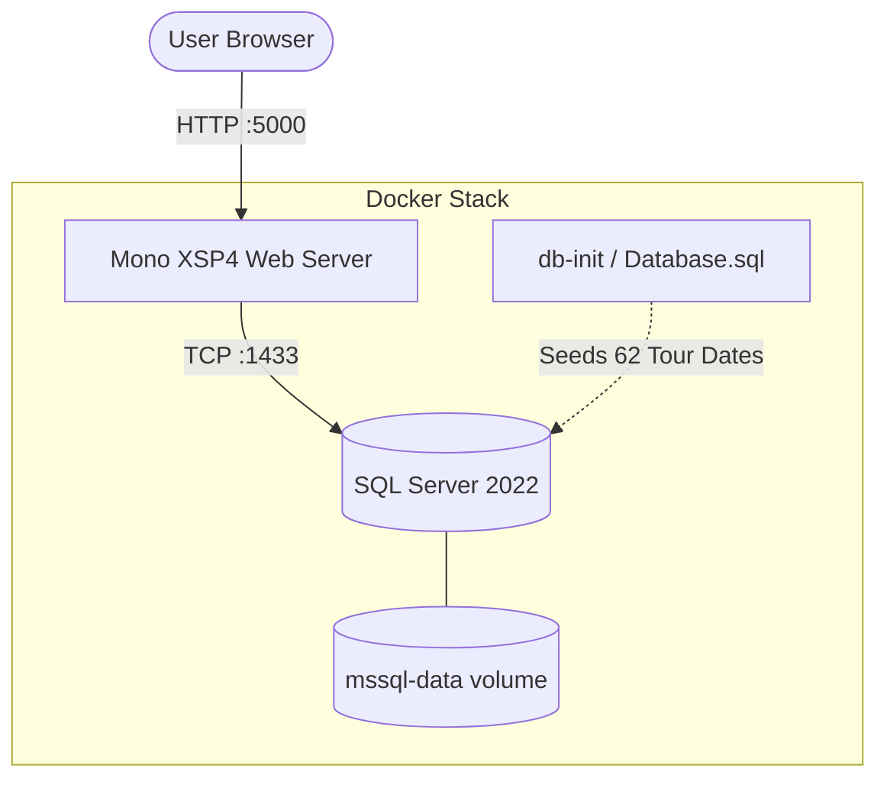

# The Unraveled Tour - ASP.NET Web Forms Concert Planner

[](https://github.com/joshimaitri11/Unravaled-Tour/actions)
[](LICENSE)
[](https://dotnet.microsoft.com/)
[](https://www.mono-project.com/)
[](https://www.microsoft.com/sql-server)
[](https://codespaces.new/joshimaitri11/Unravaled-Tour)

A fan-made concert tour and ticket planning web portal built with **ASP.NET Web Forms (C#)** and **Microsoft SQL Server**.

Designed for seamless cross-platform execution:
- **Linux / macOS**: Runs in Docker via Mono XSP4 and SQL Server 2022.
- **Windows**: Runs natively via Visual Studio & SQL Server LocalDB.
- **Production / Cloud**: Ready to deploy with single-command Docker Compose on any VPS or container host.

---

## 🏗️ Architecture



---

## 🚀 Quick Start (Docker)

### Prerequisites
- [Docker](https://docs.docker.com/get-docker/) & [Docker Compose](https://docs.docker.com/compose/)

### 1. Clone & Configure
```bash
git clone https://github.com/joshimaitri11/Unravaled-Tour.git
cd unraveled-tour-aspnet
cp .env.example .env
```

### 2. Start the Stack
```bash
docker compose up --build -d
```

### 3. Open in Browser
Visit **[http://localhost:5000/Default.aspx](http://localhost:5000/Default.aspx)**

To stop the services:
```bash
docker compose down
```

---

## 🪟 Windows Setup (Visual Studio)

### Prerequisites
- Windows 10/11
- [Visual Studio 2019/2022](https://visualstudio.microsoft.com/) with **ASP.NET and web development** workload
- **SQL Server LocalDB** (included in Visual Studio installer)

### Steps
1. Open Visual Studio.
2. In **SQL Server Object Explorer**, expand `(localdb)\MSSQLLocalDB`.
3. Right-click and select **New Query...**.
4. Paste the contents of [`Database.sql`](Database.sql) and click **Execute** (`Ctrl + Shift + E`).
5. Open the project folder via **File** > **Open** > **Web Site...** (`Shift + Alt + O`).
6. Set `Default.aspx` as Start Page and press `Ctrl + F5`.

---

## ☁️ Deployment

### Option 1: 1-Click Launch on GitHub (Codespaces)
Run the entire application stack in GitHub's cloud environment with no local setup needed:

1. Click the **Open in GitHub Codespaces** badge or click the green **Code** button > **Codespaces** > **Create codespace on main**.
2. GitHub automatically starts the Docker Compose stack (Mono XSP4 + SQL Server + Database seed).
3. The forwarded port notification will automatically open your live browser preview at `https://<codespace-id>-5000.app.github.dev/Default.aspx`.

---

### Option 2: VPS / Cloud VM (Docker Compose)
Deploy on Ubuntu / Debian (DigitalOcean, AWS EC2, Hetzner, Linode, Azure VM):

1. **Install Docker Engine**:
   ```bash
   curl -fsSL https://get.docker.com | sh
   ```
2. **Clone and Configure**:
   ```bash
   git clone https://github.com/joshimaitri11/Unravaled-Tour.git
   cd Unravaled-Tour
   cp .env.example .env

   # Update MSSQL_SA_PASSWORD in .env with a secure password
   ```
3. **Launch in Background**:
   ```bash
   docker compose up --build -d
   ```
4. Configure a reverse proxy (e.g. Nginx, Caddy, or Traefik) to map `http://localhost:5000` to port 80/443 with HTTPS.

### Option 2: Azure Container Apps / AWS ECS
The repository includes a standalone [`Dockerfile`](Dockerfile) with dynamic `PORT` binding and healthchecks ready to be built and pushed to Docker Hub or GitHub Container Registry (GHCR):

```bash
docker build -t your-username/unraveled-tour-web:latest .
docker push your-username/unraveled-tour-web:latest
```

---

## 🔐 Accounts & Credentials

| Role | Email | Capabilities |
| :--- | :--- | :--- |
| **Fan** | Any valid email (e.g., `fan@gmail.com`) | Browse dates, plan tickets, choose packages, view bookings |
| **Admin** | `admin@unraveled.fan` | Full access + Admin navigation tab to **Create, Edit, and Delete** tour dates |

---

## ⚙️ Environment Variables

| Variable | Default | Description |
| :--- | :--- | :--- |
| `PORT` | `5000` | Port for the Mono XSP4 web server |
| `MSSQL_SA_PASSWORD` | `Password_123!` | Password for the SQL Server SA account |
| `DB_PORT` | `1433` | Host port exposed for SQL Server |
| `UNRAVELED_DB` | Connection string | Connection string consumed by `App_Code/Db.cs` |
| `ADMIN_EMAIL` | `admin@unraveled.fan` | Email recognized as administrator |

---

## 📁 Repository Structure

```
├── Admin.aspx / .cs        # Admin CRUD dashboard for tour management
├── App_Code/
│   └── Db.cs               # C# ADO.NET helper for SQL Server queries
├── Database.sql            # Idempotent DB schema and initial tour data
├── Default.aspx / .cs      # Interactive fan/admin login page
├── Dockerfile              # Ubuntu 20.04 + Mono XSP4 container
├── docker-compose.yml      # Multi-container orchestration (Web + MSSQL + Init)
├── Home.aspx               # Main landing page with tour banner and highlights
├── images/                 # Album art and promo banners
├── Plan.aspx / .cs         # Interactive ticket planning and budgeting tool
├── Site.master / .cs       # Master page layout and navigation
├── site.js                 # UI interactions and client-side styling
├── style.css               # Modern CSS design system
└── Tours.aspx / .cs        # Dynamic tour dates list with search/filtering
```

---

## 📄 License

This project is licensed under the [MIT License](LICENSE).
